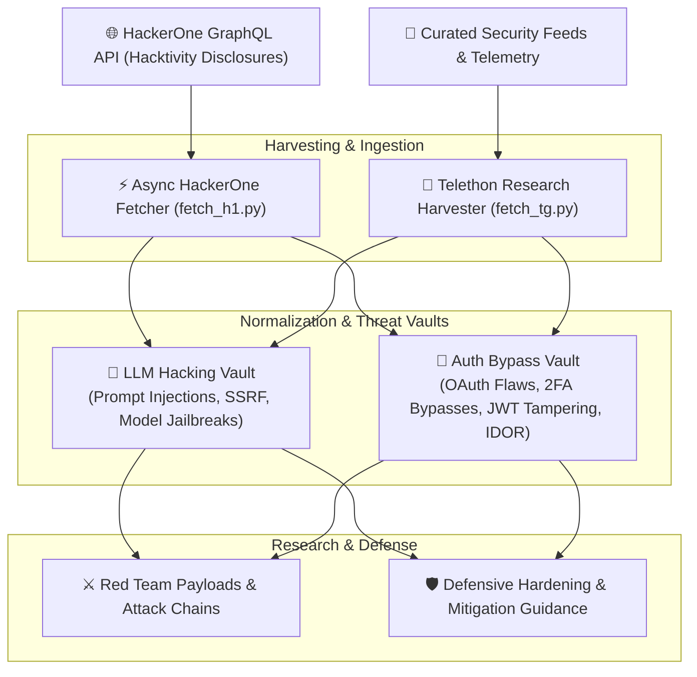

<div align="center">

# 🧠 LLM & Auth Security Vault

### Intelligence Pipeline & Research Archive for LLM Red Teaming and Modern Authentication Bypasses

[](https://www.python.org/)
[](https://owasp.org/www-project-top-10-for-large-language-model-applications/)
[](https://hackerone.com/)
[](https://github.com/LonamiWebs/Telethon)
[](LICENSE)

**LLM Jailbreak Archives • Prompt Injection Analysis • OAuth & SSO Flaws • Automated Disclosures Ingestion**

[Intelligence Pipeline](#-intelligence-pipeline-architecture) • [Research Vaults](#-research-vaults) • [Quick Start](#-quick-start) • [Responsible Research](#-responsible-research--ethics)

</div>

---

## 🎯 Overview

**LLM & Auth Security Vault** is a specialized intelligence gathering framework and research repository focused on the intersection of **Artificial Intelligence Security** and **Modern Identity/Access Control Systems**.

As generative AI agents and enterprise single-sign-on architectures expand, attack vectors targeting LLM inference layers and tokenized authentication protocols have multiplied. This repository houses automated pipelines that harvest high-severity disclosed vulnerabilities from **HackerOne Hacktivity** and leading security research forums, categorizing findings into structured analytical archives.

---

## 🏗 Intelligence Pipeline Architecture



---

## 📚 Research Vaults

### 1. 🧠 LLM Hacking Vault (`llm_hacking_vault/`)
In-depth case studies, proof-of-concept payloads, and real-world vulnerability reports aligned with the **OWASP Top 10 for Large Language Model Applications**:
- **Prompt Injection & Jailbreaks:** Direct and indirect prompt injections overriding system guardrails.
- **Insecure Output Handling:** Reflected Cross-Site Scripting (XSS) and SSRF executed via unsanitized LLM generations.
- **Agent Tool Execution Hijacking:** Manipulating AI agent tool-calling contexts to achieve unintended code execution.

### 2. 🔐 Authentication Bypass Vault (`auth_bypass_vault/`)
Empirical research and verified vulnerability reports covering modern authorization failures:
- **OAuth 2.0 & SSO:** Redirect URI poisoning, state parameter omission, and pre-account takeover vulnerabilities.
- **Multi-Factor Authentication (MFA):** Rate limit evasion, response status manipulation, and token leakage vectors.
- **JSON Web Tokens (JWT):** Algorithm confusion (`none`), weak HMAC secrets, and signature spoofing.
- **Insecure Direct Object Reference (IDOR):** Horizontal and vertical privilege escalation in multi-tenant APIs.

---

## 💻 Quick Start

### 1. Environment Setup
```bash
# Clone the repository
git clone https://github.com/3bkader-gpt/llm-security-vault.git
cd llm-security-vault

# Create virtual environment
python -m venv .venv

# On Linux/macOS:
source .venv/bin/activate
# On Windows:
.venv\Scripts\activate

# Install requirements
pip install -r requirements.txt
```

### 2. Configure Credentials (`.env`)
Copy the environment template and provide your API keys:
```bash
cp .env.example .env
```

```ini
# Optional: Telegram API credentials for research channel updates
TELEGRAM_API_ID=your_api_id
TELEGRAM_API_HASH=your_api_hash
TELEGRAM_PHONE=+1234567890
```

### 3. Running Scrapers
```bash
# Ingest high-severity disclosures from HackerOne
python fetch_hackerone.py

# Ingest authentication writeups from configured feeds
python fetch_auth_h1.py
```

---

## ⚖️ Responsible Research & Ethics

> [!IMPORTANT]
> The proof-of-concept payloads, intelligence feeds, and research summaries in this repository are published solely for defensive security education, vulnerability remediation, and threat modeling. All research aligns with publicly disclosed reports and authorized assessments.

---

## 📄 License

This research archive is open-source under the [MIT License](LICENSE).
